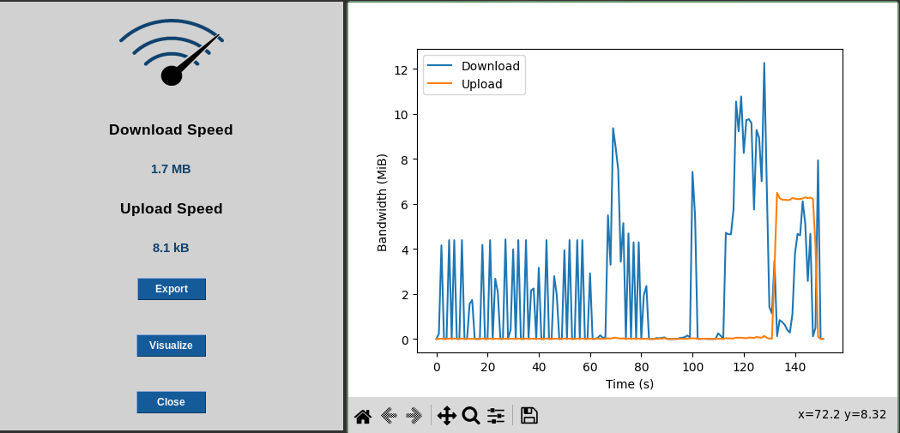

## Bandwidth Monitoring System
This project is a simple GUI application that monitors and logs the download and upload speeds of a computer's network connection. It provides a real-time display of the current speeds and allows the user to export and visualize the logged data.
### Usage
To start the application, run the following command:

`> pip install -r requirements.txt`

`> python main.py`

The GUI will display the current download and upload speeds and will update the values every second. You can click the "Export" button to save the logged data to a CSV file, or the "Visualize" button to generate a graph of the data. You can also click the "Close" button to exit the application.

The following screenshot shows the main window of the application, which displays the current download and upload speeds in real-time, as well as the visualized data in a graph.
